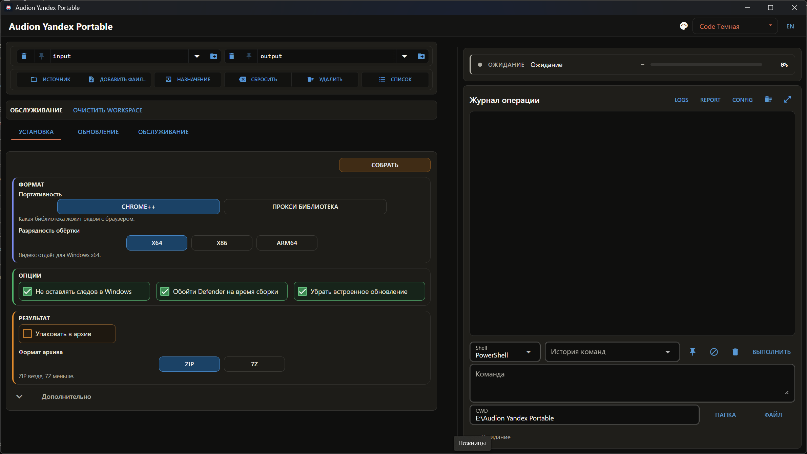

# Audion Yandex Portable

<!-- audion:release -->

  
  
  
  

**Версия 1.0.2** · 2026-09-04 · 82.3 MB

- [Скачать напрямую](https://audion.dev/get/yandex-portable/1.0.2/Audion_Yandex_Portable_v1.0.2_Full.zip) — быстрая раздача, без ограничений
- [Страница проекта](https://audion.dev/downloads/yandex-portable) — все версии и установка

`SHA-256: 165347f492587e65a6f46bd8840f841fbb3fcf366e92f9c26f0b35f7de267122`

---

Проект набора **Audion** — издаёт [Tensionix](https://github.com/Tensionix).
<!-- /audion:release -->

[English](docs/README_EN.md) · [Руководство](docs/USER_GUIDE_RU.md)

**Содержание**

- [Зачем это сделано](#зачем-это-сделано)
- [Как это устроено](#как-это-устроено)
- [Chrome++](#chrome)
- [Дальше](#дальше)
- [Техническая часть](#техническая-часть)
  - [Что в сборке](#что-в-сборке)
  - [Обновление](#обновление)

Собирает портативный Яндекс.Браузер, обновляет собранное и держит в свежем виде
Chrome++, на котором держится сама портативность.

## Зачем это сделано

У Яндекс.Браузера портативной сборки нет, а причин её иметь — две, и вторая
неочевидна.

**Первая: браузер отделяется от системы и переносится папкой.** Обычная выгода
портативности.

**Вторая: сертификаты НУЦ Минцифры у него уже встроены.** Российские
государственные порталы выдают сертификаты, которых нет в хранилище Windows;
другие браузеры без них эти сайты не открывают, и приходится ставить корневые
сертификаты в систему. Яндекс.Браузер несёт их с собой — значит портативная
сборка открывает такие сайты **не трогая системное хранилище вообще**.

В Windows при этом ничего не устанавливается: дистрибутив распаковывается, а не
запускается.

## Как это устроено

Полный дистрибутив — исполняемый файл, в ресурсах которого лежит ровно один
архив с браузером. Программа достаёт его и раскладывает в папку сборки: браузер,
профиль, файл запуска.

## Chrome++

На нём держится портативность сборки, поэтому он обновляется наравне с самим
браузером.

Про него стоит знать одно: **сборка может упасть на упаковке с ошибкой доступа
к файлу** — и это не диск и не битый архив, а антивирус, разбирающий свежий
исполняемый файл. Разобрано в `tools\CHROME_PLUS_AND_DEFENDER.md`.

## Дальше

* [Руководство](docs/USER_GUIDE_RU.md) — работа по шагам.
* [Проверки](docs/SMOKE_TEST_RU.md) — что прогоняется перед выпуском.
* `tools\CHROME_PLUS_AND_DEFENDER.md` — Chrome++ и антивирус.
* `tools\DECISIONS_EN.md` — принятые решения.

---

## Техническая часть

### Что в сборке

Браузер, профиль с закладками и расширениями, файл запуска и запись о том, какие
версии внутри. Переносится целиком, следов в системе не оставляет.

### Обновление

Сверяется, что вышло у разработчика, с тем, что в сборке. Обновляется только
изменившееся, профиль не трогается.
